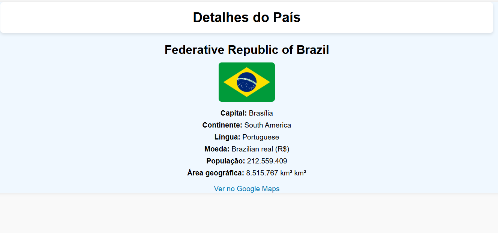

# projeto buscador de paises
o objetivo do projeto e pesquisar paises atravez de uma API: https://restcountries.com/

## Design do projeto


## API utilizada


a API https://viacep.com.br/ retorna um json contendo as seguintes informações:

```
// https://viacep.com.br/ws/01001000/json/

[
  {
    "name": {
      "common": "Brazil",
      "official": "Federative Republic of Brazil",
      "nativeName": {
        "por": {
          "official": "República Federativa do Brasil",
          "common": "Brasil"
        }
      }
    },
    "tld": [
      ".br"
    ],
    "cca2": "BR",
    "ccn3": "076",
    "cca3": "BRA",
    "cioc": "BRA",
    "independent": true,
    "status": "officially-assigned",
    "unMember": true,
    "currencies": {
      "BRL": {
        "name": "Brazilian real",
        "symbol": "R$"
      }
    }
    },
    "capital": [
      "Brasília"
    ],
    "altSpellings": [
      "BR",
      "Brasil",
      "Federative Republic of Brazil",
      "República Federativa do Brasil"
    ],
    "region": "Americas",
    "subregion": "South America",
    "languages": {
      "por": "Portuguese"
    },

    "flag": "🇧🇷",
    "maps": {
      "googleMaps": "https://goo.gl/maps/waCKk21HeeqFzkNC9",
      "openStreetMaps": "https://www.openstreetmap.org/relation/59470"
    },
    "population": 212559409,
    "gini": {
      "2019": 53.4
    },
    "fifa": "BRA",
    "car": {
      "signs": [
        "BR"
      ],
      "side": "right"
    },
    "timezones": [
      "UTC-05:00",
      "UTC-04:00",
      "UTC-03:00",
      "UTC-02:00"
    ],
    "continents": [
      "South America"
    ],
    "flags": {
      "png": "https://flagcdn.com/w320/br.png",
      "svg": "https://flagcdn.com/br.svg",
      "alt": "The flag of Brazil has a green field with a large yellow rhombus in the center. Within the rhombus is a dark blue globe with twenty-seven small five-pointed white stars depicting a starry sky and a thin white convex horizontal band inscribed with the national motto 'Ordem e Progresso' across its center."
    },
    "coatOfArms": {
      "png": "https://mainfacts.com/media/images/coats_of_arms/br.png",
      "svg": "https://mainfacts.com/media/images/coats_of_arms/br.svg"
    },
]
```
## funcionalidades

- [x] buscar países
- [x] visualizar bandeiras
- [x] encontrar detalhes sobre os países
- [x] pesquisar pelos continentes
- [x] encontrar países atravéz do nome

### observações
> [!NOTE]
> projeto feito na disciplina de programação web 1 do curso de ADS do ifce de jaguaruna/ce

## Contatos

Email: guilhermesilva2022.gs@gmail.com
